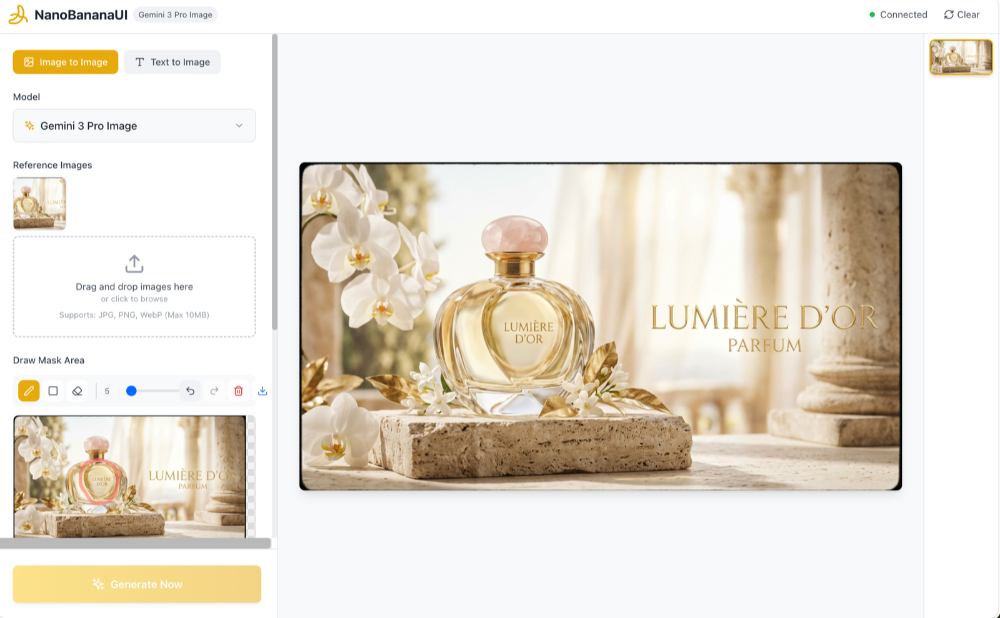

# NanoBananaUI

AI Image Generation Studio powered by Google Gemini. A full-stack application with a React frontend and FastAPI backend that supports text-to-image, image-to-image, and inpainting workflows.

## Screenshots

| Text to Image | Image to Image |
|---|---|
|  |  |

## Features

- **Text-to-Image** — Generate images from text prompts
- **Image-to-Image** — Transform existing images with text guidance
- **Inpainting** — Edit specific regions of an image using a mask editor
- **Multi-Model** — Switch between Gemini 3 Pro Image and Gemini 3.1 Flash Image
- **Image Controls** — Aspect ratio, resolution (1K/2K/4K), thinking level, Google Search grounding
- **Streaming** — Real-time SSE streaming of generated content
- **Desktop App** — Optional Electron wrapper for macOS

## Project Structure

```
NanoBananaUI/
├── backend/           # FastAPI server
│   ├── app/
│   │   ├── config.py          # Configuration & auth mode
│   │   ├── main.py            # FastAPI app entry
│   │   ├── models/schemas.py  # Pydantic models
│   │   ├── routers/chat.py    # API endpoints
│   │   └── services/vertex_ai.py  # Gemini client
│   ├── .env.example   # Environment config template
│   └── requirements.txt
├── frontend/          # React + TypeScript + Vite
│   └── src/
│       └── components/ImageStudio/  # Main UI components
├── electron/          # Electron desktop wrapper
├── scripts/           # Build scripts (Docker, macOS)
└── Dockerfile         # Single-image build (frontend + backend)
```

## Quick Start

### 1. Backend

```bash
cd backend
python -m venv .venv && source .venv/bin/activate
pip install -r requirements.txt
```

Copy and edit the environment config:

```bash
cp .env.example .env
```

### 2. Authentication

NanoBananaUI supports two authentication modes, configured via `AUTH_MODE` in `backend/.env`:

**AI Studio (recommended for personal use)**

```env
AUTH_MODE=ai_studio
GOOGLE_AI_STUDIO_API_KEY=your_api_key_here
```

Get an API key from [Google AI Studio](https://aistudio.google.com/apikey).

**Vertex AI (for GCP projects)**

```env
AUTH_MODE=vertex_ai
VERTEX_PROJECT_ID=your-project-id
VERTEX_LOCATION=global
```

Place your service account JSON in the `auth/` directory — it will be auto-detected. Or set `GOOGLE_APPLICATION_CREDENTIALS` explicitly.

### 3. Run

```bash
# Backend (from backend/)
uvicorn app.main:app --reload --port 8000

# Frontend (from frontend/)
npm install && npm run dev
```

Open http://localhost:5173

## Docker

```bash
# Build
docker build -t nanobananaui .

# Run with AI Studio
docker run -p 8000:8000 \
  -e AUTH_MODE=ai_studio \
  -e GOOGLE_AI_STUDIO_API_KEY=your_key \
  nanobananaui

# Run with Vertex AI (mount credentials)
docker run -p 8000:8000 \
  -v /path/to/auth:/app/auth \
  nanobananaui
```

## Supported Models

| Model ID | Name | Features |
|---|---|---|
| `gemini-3-pro-image-preview` | Gemini 3 Pro Image | Text-to-image, image-to-image, inpainting. High quality generation (default) |
| `gemini-3.1-flash-image-preview` | Gemini 3.1 Flash Image | Same as Pro + thinking level control and Google Search grounding. Faster speed |

## API

| Endpoint | Method | Description |
|---|---|---|
| `/api/health` | GET | Health check (returns status, model, auth_mode) |
| `/api/models` | GET | List available models |
| `/api/chat` | POST | Generate response (non-streaming) |
| `/api/chat/stream` | POST | Generate response (SSE streaming) |
| `/api/upload` | POST | Upload and validate an image |

API docs available at http://localhost:8000/docs
